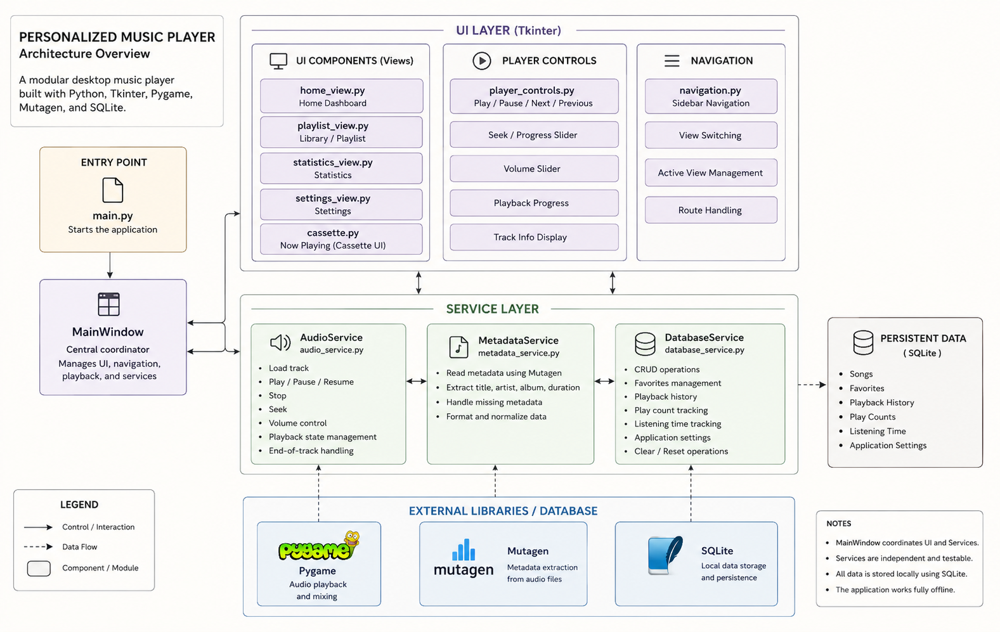
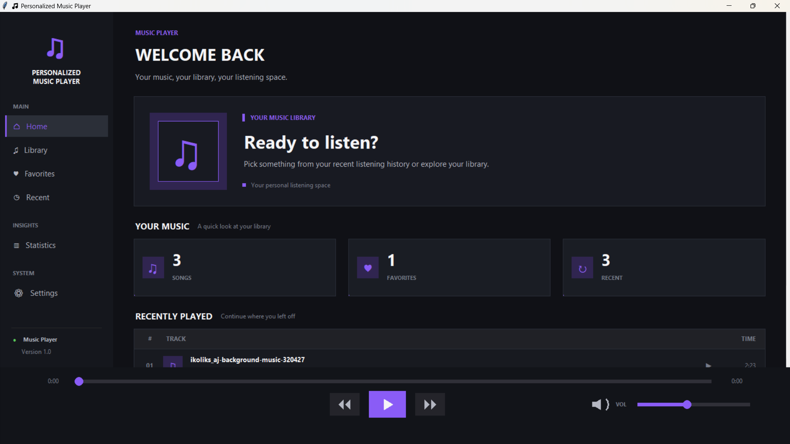
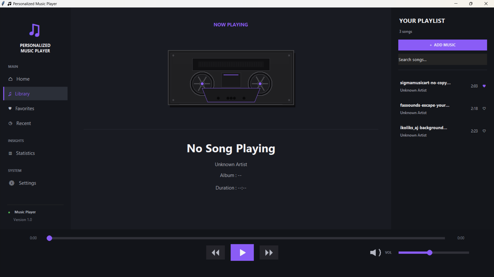
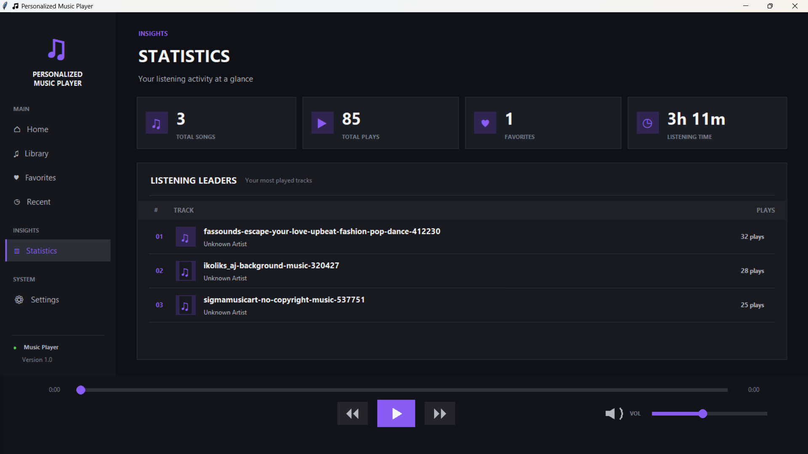
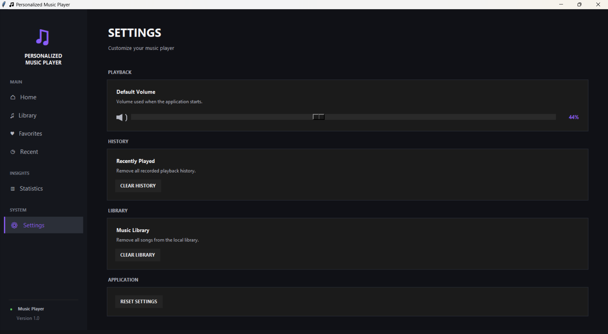

# 🎵 Personalized Music Player

A polished desktop music player built with Python, Tkinter, Pygame, Mutagen, and SQLite. It provides a dark-themed interface for managing a local music library, playing songs, managing favorites, tracking listening history, and viewing listening statistics.

---

## 📖 Table of Contents

- [Overview](#-overview)
- [Features](#-features)
- [Tech Stack](#-tech-stack)
- [Architecture](#-architecture)
- [Project Structure](#-project-structure)
- [Installation](#-installation)
- [Development Setup](#-development-setup)
- [Playback Controls](#-playback-controls)
- [Testing](#-testing)
- [Screenshots](#-screenshots)
- [Documentation](#-documentation)
- [Project Goals](#-project-goals)
- [Future Improvements](#-future-improvements)
- [Author](#-author)
- [License](#-license)

---

## 🧭 Overview

**Personalized Music Player** is a desktop application for organizing and playing a local music collection. It reads metadata automatically, remembers favorites and listening history between sessions, and presents usage statistics through a clean, dark-themed, purple-accented UI.

All application data is stored locally using SQLite.

---

## ✨ Features

### 📚 Music Library
- Add local music files
- Automatically read available song metadata
- Display title, artist, album, and duration
- Prevent duplicate songs
- Search the music library
- Handle long song names without breaking the UI

### ▶️ Music Playback
- Play, Pause, Resume
- Previous / Next track navigation
- Automatically play the next song when the current song finishes
- Seek through the current song
- Real-time playback progress
- Current playback time and total duration

### 🔊 Audio Controls
- Adjustable volume
- Custom volume slider with visual volume indicator
- Custom playback controls
- Custom seek/progress slider

### ⭐ Favorites
- Add/remove favorites
- Dedicated Favorites view
- Favorite state persists between sessions

### 🕒 Listening History
- Recently played songs
- Playback history tracking
- Recent Songs view
- Track play counts

### 📊 Statistics
- Total songs
- Total plays
- Favorite songs count
- Total listening time
- Most-played songs
- Individual play counts

### ⚙️ Settings
- Persistent volume settings
- Clear listening history
- Clear music library
- Reset application settings
- Confirmation dialogs for destructive actions

### 🎨 UI
- Dark theme with a purple accent color system
- Custom navigation sidebar
- Custom cassette-style Now Playing display
- Long-title handling
- Hover states and active navigation states
- Custom playback buttons and sliders
- Dashboard cards
- Views: Home, Library, Favorites, Recent, Statistics, Settings

---

## 🛠 Tech Stack

| Category            | Technology       |
|----------------------|-----------------|
| Language             | Python 3.13     |
| GUI Framework        | Tkinter         |
| Audio Playback       | Pygame 2.6.1    |
| Metadata Extraction  | Mutagen 1.48.1  |
| Database             | SQLite          |
| Code Formatting      | Black 26.5.1    |
| Import Sorting       | isort 8.0.1     |
| Linting              | Flake8 7.3.0    |
| Testing              | Pytest 9.1.1    |
| Version Control      | Git / GitHub    |

---

## 🏗 Architecture

The application follows a **modular architecture**, separating the entry point, UI, services, and data models.

- **`main.py`** — Starts the application.
- **`MainWindow`** — Coordinates the UI, playback, navigation, and services.

### Architecture Diagram



### Services

| Service            | Responsibility                                                        |
|---------------------|-------------------------------------------------------------------------|
| `AudioService`      | Loading, playing, pausing, resuming, stopping, seeking, and volume control |
| `MetadataService`   | Reads music metadata using Mutagen                                     |
| `DatabaseService`   | Manages SQLite persistence                                              |

### UI Components

- `cassette.py` — Cassette-style Now Playing display
- `home_view.py` — Home dashboard view
- `main_window.py` — Main application window/coordinator
- `navigation.py` — Sidebar navigation
- `player_controls.py` — Playback controls
- `playlist_view.py` — Library/playlist view
- `settings_view.py` — Settings view
- `statistics_view.py` — Statistics view
- `theme.py` — Theme and styling definitions

### Models

- `song.py` — Song data model

### Persistent Data (SQLite)

- Songs
- Favorites
- Playback history
- Play counts
- Listening time
- Application settings

---

## 📁 Project Structure

```text
Personalized-Music-Player/
├── .github/
├── .vscode/
│   └── settings.json
├── assets/
│   ├── album_art/
│   ├── icons/
│   ├── images/
│   └── themes/
├── data/
├── docs/
│   ├── diagrams/
│   └── screenshots/
├── src/
│   ├── controllers/
│   ├── database/
│   ├── models/
│   │   └── song.py
│   ├── services/
│   │   ├── audio_service.py
│   │   ├── database_service.py
│   │   └── metadata_service.py
│   ├── ui/
│   │   ├── cassette.py
│   │   ├── home_view.py
│   │   ├── main_window.py
│   │   ├── navigation.py
│   │   ├── player_controls.py
│   │   ├── playlist_view.py
│   │   ├── settings_view.py
│   │   ├── statistics_view.py
│   │   └── theme.py
│   ├── utils/
│   └── widgets/
├── tests/
├── .editorconfig
├── .gitignore
├── LICENSE
├── main.py
├── pyproject.toml
├── requirements.txt
└── requirements-dev.txt
```
---

## 🚀 Installation

The steps below use **Windows PowerShell**.

### 1. Clone the repository

```powershell
git clone https://github.com/KS2010/PersonalizedMusicPlayer.git
cd Personalized-Music-Player
```

### 2. Create a virtual environment

```powershell
python -m venv venv
```

### 3. Activate the virtual environment

```powershell
.\venv\Scripts\Activate.ps1
```

### 4. Install runtime dependencies

```powershell
python -m pip install -r requirements.txt
```

### 5. Run the application

```powershell
python main.py
```

---

## 🧑‍💻 Development Setup

To install development dependencies (formatting, linting, and testing tools) in addition to runtime dependencies:

```powershell
python -m pip install -r requirements-dev.txt
```

`requirements-dev.txt` includes:

```text
-r requirements.txt
black==26.5.1
flake8==7.3.0
isort==8.0.1
pytest==9.1.1
```

Recommended development workflow:

```powershell
# Format code
black src

# Sort imports
isort src

# Lint code
flake8 src
```

---

## 🎛 Playback Controls

| Control          | Description                                      |
|-------------------|---------------------------------------------------|
| ⏮ Previous       | Plays the previous song in the library            |
| ⏯ Play / Pause   | Toggles between playing and pausing the current song |
| ⏭ Next           | Plays the next song in the library                |
| ━ Progress Slider | Seeks to a specific position in the current song  |
| 🔊 Volume Slider  | Adjusts playback volume with a visual indicator   |

---

## 🧪 Testing

To verify that all source files compile correctly:

```powershell
python -m compileall src
```

This project was successfully verified in a **fresh virtual environment** containing only the packages listed in `requirements.txt` (`pygame` and `mutagen`), confirming that the application's core runtime dependencies are correctly declared and sufficient to run the app.

---

## 🖼 Screenshots

### Home


### Library


### Statistics


### Settings


---

## 📄 Documentation

Additional project documentation is organized under the `docs/` directory:

- `docs/diagrams/` — Architecture and design diagrams
- `docs/screenshots/` — Application screenshots

---

## 🎯 Project Goals

This project was built to practice and demonstrate:

- Object-oriented programming
- GUI development
- Event-driven programming
- Audio processing
- Metadata extraction
- Database design
- Persistent application state
- Modular software architecture
- UI design
- Version control

---

## 🔭 Future Improvements

- Album artwork extraction and display
- Playlist creation and management
- Shuffle and repeat modes
- Keyboard media-key support
- Drag-and-drop music importing
- More advanced search and filtering
- Audio visualization
- Additional audio format support
- Improved automated test coverage
- Cross-platform packaging
- Standalone executable releases

---

## 🗒 Notes on Generated / Local Files

The following generated and local files are excluded from version control via `.gitignore`:

```text
venv/
.venv/
__pycache__/
*.pyc
*.db
*.sqlite
*.sqlite3
*.log
```


## 👤 Author

**K S**

Computer Science Engineering Student interested in software development, cybersecurity, and building practical applications.

---

## 📜 License

This project is licensed under the **MIT License**.

See the [LICENSE](LICENSE) file for details.
